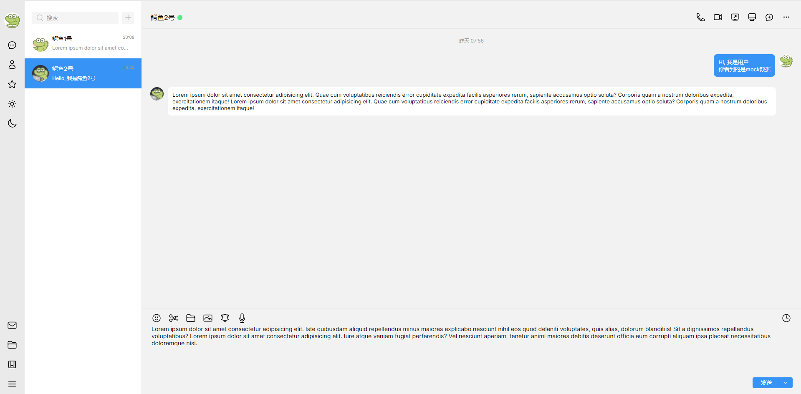

<h1 align="center">QQ Desktop前端模仿(学习目的)</h1>

## :dart: 项目介绍 ##

用html和scss模仿的QQ Desktop的前端, **无任何js代码!!!**

**仅用于学习目的!!!**

效果预览:



编译好的css已上传到本仓库, 因此克隆项目后, 你可以直接打开`index.html`查看效果, 请勿在任何具有**公网ip**的服务器上部署本项目!!!

如果你想修改样式, 应该修改scss目录下的文件

由于css是由scss生成的, 因此请勿直接修改css目录下的任何文件

## :sparkles: 目录介绍 ##

```bash
.
├── index.html            # 项目入口
├── Makefile              # 将scss文件编译为css的快捷方式
│
├── scss                  # 存放scss格式的sass文件 
│   ├── _common.scss      # 存放一些共用的变量
│   ├── chat-option.scss  # 好友栏
│   ├── main.scss         # 消息显示和消息输入区域
│   ├── menu.scss         # 右上方的菜单栏
│   ├── nav.scss          # 左侧的导航栏
│   ├── search.scss       # 左上方的消息搜索栏
│   └── style.scss
│
├── img                   # 存放一些头像图片
│   ├── avatar-1.jpg      # 用户的第一个好友的头像 
│   ├── avatar-2.jpg      # 用户的第二个好友的头像
│   └── avatar-user.jpg   # 用户的头像
│ 
└── css                   # 由scss目录编译生成的css文件
    ├── *.css         
    └── *.map             # 由sass生成
```


## :checkered_flag: 编译scss ##

```bash
# 单次编译
$ make sass

# 热更新
$ make sass-watch
```

## :memo: License ##

本项目采用**BSD 3-Clause** License. 更多细节在[LICENSE](LICENSE.md).


Made with :heart: by <a href="https://github.com/zjy-dev" target="_blank">zjy-dev</a>

